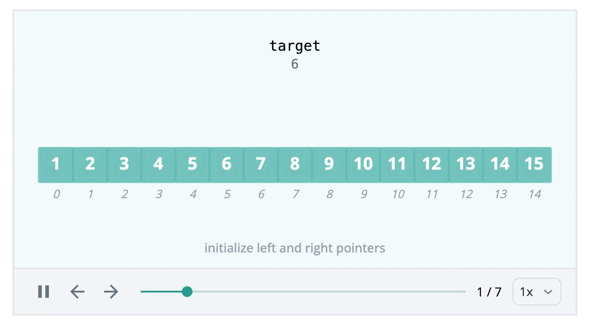
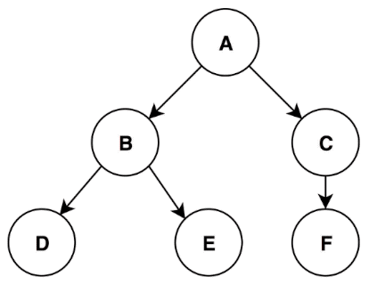
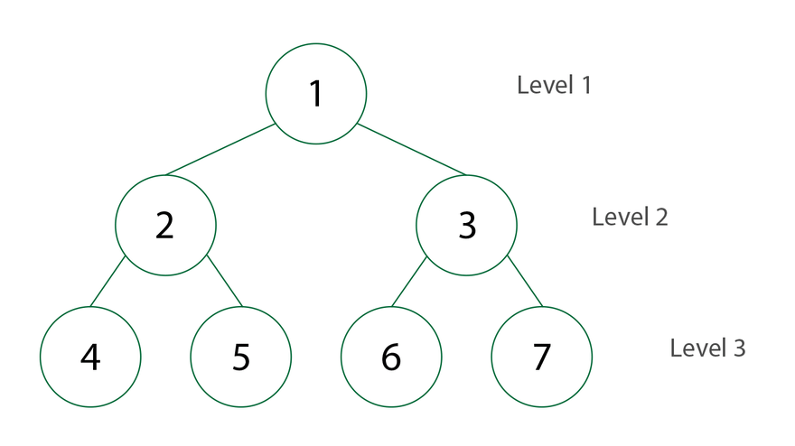
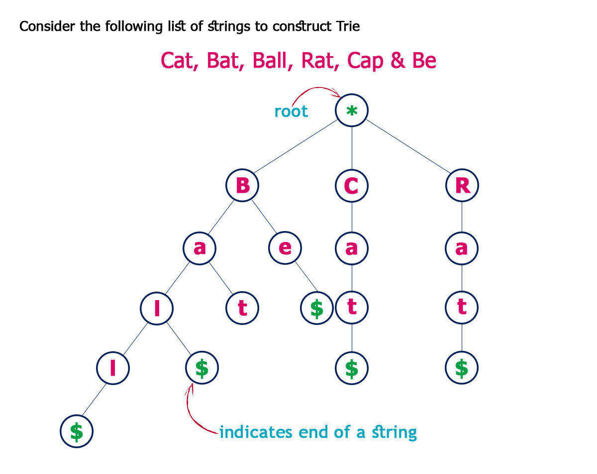
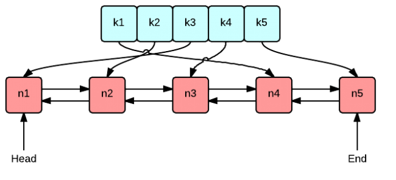

# DSA

---

# Algorithmic Paradigms (High-level / Strategic)

## Greedy Algorithm

### Core Concept

A **Greedy Algorithm** builds up a solution piece by piece, always choosing the next piece that offers the most obvious and immediate benefit. It makes a locally optimal choice at each stage with the hope that these local choices will lead to a globally optimal solution. Once a choice is made, it is never reconsidered (no backtracking).

### When to Use

- **Optimization Problems:** When you need to find the maximum or minimum of something (e.g., shortest path, minimum spanning tree).
- **Greedy Choice Property:** When a globally optimal solution can be arrived at by selecting a local optimum at every step.
- **Optimal Substructure:** When an optimal solution to the problem contains optimal solutions to the sub-problems.
- **Common Applications:** Dijkstra's Shortest Path, Huffman Coding, Activity Selection, Fractional Knapsack, Coin Change (for standard denominations), and specific array/interval problems (e.g., Jump Game, Merge Intervals).

### Complexity

- **Time:** Usually **O(N log N)** because greedy problems often require sorting the dataset first before making choices. If the dataset is already sorted, it can be **O(N)**.
- **Space:** Often **O(1)** auxiliary space (if no extra structures are needed), though sorting algorithms might require **O(log N)** or **O(N)** space depending on the language's internal implementation.

### Properties

- **Category:** Algorithmic Paradigm.
- **In-place:** Usually yes (evaluates data iteratively without huge allocations).
- **Pros:** Simpler to conceptualize and generally faster than Dynamic Programming.
- **Cons:** Does not guarantee a globally optimal solution for *every* problem type (e.g., it fails on the 0/1 Knapsack problem where Dynamic Programming is required).

### Java Implementation (Activity Selection Problem)

```java
import java.util.Arrays;
import java.util.Comparator;

public class GreedyAlgorithm {

    /**
     * Example: Activity Selection Problem
     * Given start and end times of activities, find the maximum number of activities
     * that can be performed by a single person (they cannot overlap).
     */
    public static int maxActivities(int[][] activities) {
        if (activities == null || activities.length == 0) return 0;

        // Step 1: Sort activities based on their end times (the Greedy Choice)
        // This ensures we leave as much time as possible for remaining activities.
        Arrays.sort(activities, Comparator.comparingInt(a -> a[1]));

        int count = 1; // We always select the first activity after sorting
        int lastEndTime = activities[0][1];

        // Step 2: Iterate and pick the next compatible activity
        for (int i = 1; i < activities.length; i++) {
            int currentStartTime = activities[i][0];

            // If the activity starts after or when the last one finished, we can do it!
            if (currentStartTime >= lastEndTime) {
                count++;
                lastEndTime = activities[i][1];
            }
        }

        return count;
    }
}
```

### Java Implementation 2: Greedy Without Sorting (Jump Game)

Sometimes, a greedy algorithm doesn't require sorting the data first. Instead, it iterates through the dataset making local optimal choices on the fly, typically achieving **O(N)** time complexity.

```java
public class GreedyWithoutSorting {

    /**
     * Example: Jump Game (LeetCode 55)
     * Given an integer array nums. You are initially positioned at the array's first index,
     * and each element in the array represents your maximum jump length at that position.
     * Return true if you can reach the last index, or false otherwise.
     */
    public static boolean canJump(int[] nums) {
        int reachable = 0; // The furthest index we can currently reach

        for (int i = 0; i < nums.length; i++) {
            // If the current index is strictly greater than our maximum reachable index,
            // it means we are stuck and cannot move forward.
            if (i > reachable) {
                return false;
            }

            // Greedy choice: Update the furthest we can reach from this point
            reachable = Math.max(reachable, i + nums[i]);

            // Early exit: If we can already reach the end, no need to keep checking
            if (reachable >= nums.length - 1) {
                return true;
            }
        }

        return true;
    }
}
```

---

## Dynamic Programming (DP)

### Overview

Dynamic Programming (DP) is an algorithmic technique for solving optimization problems by breaking them down into simpler subproblems. It utilizes the fact that the optimal solution to the overall problem depends upon the optimal solutions to its subproblems.

### Key Concepts

1. **Overlapping Subproblems:** The problem can be broken down into subproblems which are reused several times. DP caches these results to avoid redundant computations.
2. **Optimal Substructure:** The optimal solution to a problem can be constructed from the optimal solutions of its subproblems.

### Approaches

#### 1. Top-Down (Memoization)

- **How it works:** You start solving the given problem by breaking it down. If you see that the problem has been solved already, then just return the saved answer. If it has not been solved, solve it and save the answer.
- **Implementation:** Usually implemented using recursion and a hash map or array to store results.

#### 2. Bottom-Up (Tabulation)

- **How it works:** You analyze the problem and see the order in which the subproblems are solved. You start by solving the lowest level subproblem and then iterate to the top.
- **Implementation:** Usually implemented using iteration (loops) and an array or table to store results.

---

### Example 1: Fibonacci Sequence

#### Top-Down (Memoization)

```java
import java.util.HashMap;
import java.util.Map;

public class Fibonacci {
    private Map<Integer, Integer> memo = new HashMap<>();

    public int fib(int n) {
        if (n <= 1) return n;

        // Check if we have already solved this subproblem
        if (memo.containsKey(n)) {
            return memo.get(n);
        }

        // Solve and store the result
        int result = fib(n - 1) + fib(n - 2);
        memo.put(n, result);

        return result;
    }
}
```

**Complexity:** Time `O(N)`, Space `O(N)` (for the recursion stack and memo dictionary).

### Bottom-Up (Tabulation)

```java
public class Fibonacci {
    public int fib(int n) {
        if (n <= 1) return n;

        int[] dp = new int[n + 1];
        dp[0] = 0;
        dp[1] = 1;

        for (int i = 2; i <= n; i++) {
            dp[i] = dp[i - 1] + dp[i - 2];
        }

        return dp[n];
    }

    // Space-optimized Bottom-Up
    public int fibOptimized(int n) {
        if (n <= 1) return n;

        int prev2 = 0;
        int prev1 = 1;

        for (int i = 2; i <= n; i++) {
            int current = prev1 + prev2;
            prev2 = prev1;
            prev1 = current;
        }

        return prev1;
    }
}
```

**Complexity:** Time `O(N)`, Space `O(1)` (for the optimized version).

---

### Example 2: Coin Change (Classic Interview Problem)

**Problem:** Given an integer array `coins` representing coins of different denominations and an integer `amount` representing a total amount of money, return the fewest number of coins that you need to make up that amount.

#### Bottom-Up Solution

```java
import java.util.Arrays;

public class CoinChange {
    public int coinChange(int[] coins, int amount) {
        int[] dp = new int[amount + 1];
        // Initialize the array with a value greater than any possible answer
        Arrays.fill(dp, amount + 1);
        dp[0] = 0;

        for (int i = 1; i <= amount; i++) {
            for (int coin : coins) {
                if (i - coin >= 0) {
                    dp[i] = Math.min(dp[i], dp[i - coin] + 1);
                }
            }
        }

        return dp[amount] > amount ? -1 : dp[amount];
    }
}
```

**Complexity:** Time `O(amount * coins.length)`, Space `O(amount)`.

---

## State Machine Pattern (Dynamic Programming)

### Overview

The State Machine pattern is a powerful variation of Dynamic Programming used when the transitions between subproblems depend on specific "states" or conditions. Instead of a single DP array, we maintain multiple states and define transition equations (edges) between them.

This pattern is incredibly useful for sequence or array problems with multiple constraints and conditional logic. It transforms messy `if-else` recursive checks into a clean, modular set of mathematical transitions.

### Key Concepts

1. **States (Nodes):** Represent the current condition or status at step `i` (e.g., holding a stock, resting, in cooldown).
2. **Transitions (Edges):** The actions taken to move from one state to another (e.g., Buy, Sell, Rest).

---

### Example: Best Time to Buy and Sell Stock with Cooldown (LeetCode 309)

**Problem:** Find the maximum profit you can achieve. You may complete as many transactions as you like, but after you sell your stock, you cannot buy stock on the next day (i.e., mandatory 1-day cooldown).

#### State Definitions

Instead of trying to track the cooldown with booleans or jumping indices, we define three discrete states for any given day `i`:

- `held`: We currently hold a stock.
- `sold`: We just sold a stock today (this forces us into a cooldown tomorrow).
- `rest`: We do not hold a stock, and we are not in the mandatory cooldown phase. We can either keep resting or choose to buy.

#### State Transitions (The "Edges")

- `held[i] = max(held[i-1], rest[i-1] - price)`*(Keep holding what we already had, OR buy a new stock transitioning from the rest state)*
- `sold[i] = held[i-1] + price`*(Sell the stock we were holding yesterday)*
- `rest[i] = max(rest[i-1], sold[i-1])`*(Keep resting, OR enter the rest state after finishing a cooldown from yesterday's sale)*

#### Space-Optimized Implementation (Bottom-Up)

Since day `i` only depends on day `i-1`, we do not need to allocate full `O(N)` arrays. We can just keep track of the previous day's variables, reducing the space complexity to `O(1)`.

```java
public class StockWithCooldown {
    public int maxProfit(int[] prices) {
        if (prices == null || prices.length == 0) {
            return 0;
        }

        // Initial states for day 0
        int held = -prices[0]; // Bought on day 0
        int sold = Integer.MIN_VALUE; // Impossible to sell on day 0
        int rest = 0; // Did nothing on day 0

        for (int i = 1; i < prices.length; i++) {
            int prevHeld = held;
            int prevSold = sold;
            int prevRest = rest;

            // Calculate current day's maximum profit for each state
            held = Math.max(prevHeld, prevRest - prices[i]);
            sold = prevHeld + prices[i];
            rest = Math.max(prevRest, prevSold);
        }

        // The maximum possible profit will either be in the 'sold' state or 'rest' state.
        // We would never end the sequence in the 'held' state optimally.
        return Math.max(sold, rest);
    }
}
```

**Complexity:** Time `O(N)`, Space `O(1)`.

---

### Application to Other Advanced DP Problems

Once you grasp the State Machine pattern, many Hard-level problems become heavily simplified:

- **Stock III & IV (At most `k` transactions):** You expand the states to a 2D array like `held[k]` and `unheld[k]` to track the number of transactions remaining.
- **Stock with Transaction Fee:** The exact same logic as basic Buy and Sell, but you subtract the `fee` parameter specifically during the transition from `held` to `unheld`.
- **Regular Expression Matching / Parsing:** States represent the current character matched.

---

# Algorithmic Patterns (Mid-level / Structural)

## Prefix Sum


### Core Concept

Prefix Sum involves creating an auxiliary array where the value at each index `i` is the sum of all elements from the start of the original array up to that index. This allows for extremely fast calculations of contiguous subarray sums by transforming O(N) range sum loops into O(1) mathematical operations.

### When to Use

- **Frequent range queries:** When you need to calculate the sum of elements in a specific range `[left, right]` multiple times.
- **Subarray conditions:** Finding subarrays that meet certain sum criteria (e.g., "subarray sum equals k", as in your previous problem), especially when combined with a Hash Map.
- **Static data:** Highly efficient when the underlying array is not continuously modified. (Note: if elements change frequently, a Segment Tree or Fenwick Tree is more appropriate).

### Complexity

- **Time (Precomputation):** O(N) — Requires a single pass through the array to build the prefix sums.
- **Time (Query):** O(1) — Any range sum can be calculated in constant time.
- **Space:** O(N) — Typically requires an additional array of size N+1 to store the sums safely, though it can be O(1) if modifying the input array in-place.

### Properties

- **Category:** Precomputation / Array Pattern.
- **In-place:** Optional (Can overwrite the original array, but an auxiliary array is usually used to preserve original data).
- **Adaptable:** Yes (Can be expanded to 2D matrices for 2D range sum queries).

### Java Implementation

```java
public class PrefixSum {
    private int[] prefix;

    // Precomputes the prefix sums
    public PrefixSum(int[] arr) {
        // Using size + 1 handles the edge case of querying from index 0 elegantly
        prefix = new int[arr.length + 1];
        for (int i = 0; i < arr.length; i++) {
            prefix[i + 1] = prefix[i] + arr[i];
        }
    }

    // Returns the sum of elements from index 'left' to 'right' inclusive
    public int rangeSum(int left, int right) {
        return prefix[right + 1] - prefix[left];
    }
}
```

---

# Number-Theoretic Algorithms

## Euclidean Algorithm (MDC / GCD) & Least Common Multiple (MMC / LCM)

### Core Concept

The **Greatest Common Divisor (GCD/MDC)** of two integers is the largest positive integer that divides both numbers without a remainder. The Euclidean algorithm efficiently calculates this by repeatedly replacing the larger number by its remainder when divided by the smaller number until the remainder is zero.

The **Least Common Multiple (LCM/MMC)** is the smallest positive integer that is divisible by both numbers. It is calculated elegantly using the mathematical relationship: `LCM(a, b) = |a * b| / GCD(a, b)`.

### When to Use

- **Fraction simplification:** When you need to reduce fractions to their simplest form.
- **Repeating patterns:** Determining when two cyclic events will synchronize (LCM) or finding the largest common block size to divide two lengths (GCD).
- **Number Theory problems:** Foundational for many algorithmic challenges (like the `gcdOfStrings` problem) and cryptography.

### Complexity

- **Time:** O(log(min(a, b))) — The modulo operation drastically reduces the size of the numbers in each step, making the execution time logarithmic.
- **Space:** O(log(min(a, b))) — For the recursive call stack. This can be optimized to O(1) se implementado iterativamente (using a while loop).

### Properties

- **Category:** Math / Number Theory.
- **In-place:** N/A (Math operation).
- **Prerequisite:** LCM depends directly on an efficient GCD implementation.

### Java Implementation

```java
public class MathAlgorithms {

    // Greatest Common Divisor (MDC) - Euclidean Algorithm
    public static int gcd(int a, int b) {
        if (b == 0) {
            return a;
        }
        return gcd(b, a % b);
    }

    // Least Common Multiple (MMC)
    public static int lcm(int a, int b) {
        // Prevent division by zero if inputs are zero
        if (a == 0 || b == 0) {
            return 0;
        }
        // Formula: (a * b) / GCD(a, b)
        return Math.abs(a * b) / gcd(a, b);
    }
}
```

---

# **Searching Algorithms**

## Binary Search



### Core Concept

Binary Search is an efficient algorithm for finding an item from a sorted list of items. It works by repeatedly dividing in half the portion of the list that could contain the item, comparing the middle element to the target value. 

This divide-and-conquer approach transforms an O(N) linear scan into extremely fast O(log N) lookups.

### When to Use

- **Sorted arrays:** The primary requirement is that the underlying dataset must be sorted.
- **Fast lookups:** When you need to quickly locate an element, especially in large datasets where O(N) is too slow.
- **Finding boundaries (Monotonicity):** Useful for finding the first or last occurrence of an element, or finding the point where a condition changes from false to true (e.g., finding the "first bad version" in a system).
- **Rotated arrays:** Can be adapted to search in sorted arrays that have been shifted/rotated.

### Complexity

- **Time (Search):** O(log N) — The search space is reduced by half at each step.
- **Space:** O(1) — The iterative implementation uses only a few primitive pointers (`i`, `j`, `mid`), requiring constant extra space.

### Properties

- **Category:** Search Algorithm / Divide and Conquer.
- **In-place:** Yes (evaluates the original array without requiring copies).
- **Adaptable:** Yes (Can be expanded for boundary finding, searching in 2D matrices, or binary search on answers/ranges).

### Java Implementation

```java
class Solution {
    public int search(int[] nums, int target) {
        int i = 0;
        int j = nums.length - 1;

        while (i <= j) {
            // Previne Integer Overflow: i + (j - i) / 2 em vez de (i + j) / 2
            int mid = i + (j - i) / 2;
            int midVal = nums[mid];

            if (midVal == target) return mid;

            if (target > midVal) {
                i = mid + 1;
            } else {
                j = mid - 1;
            }
        }
        return -1;
    }
}
```

---

# **Sorting Algorithms**

## **Insertion Sort**


### Core Concept

The array is virtually split into a sorted and an unsorted part. Values from the unsorted part are picked one by one and placed at their correct position in the sorted part by shifting larger elements to the right.

### When to Use

- **Small datasets:** Minimal overhead makes it faster than complex algorithms like Quick Sort or Merge Sort for small arrays (typically fewer than 50 elements).
- **Nearly sorted data:** Its adaptive nature brings the time complexity closer to O(N).
- **Memory constraints:** It requires no extra memory allocation, running with an O(1) space footprint.
- **Continuous incoming data:** Its online property allows it to efficiently sort a live stream of data as new elements arrive.

### Complexity

- **Time (Best):** O(N) — Occurs when the array is already sorted.
- **Time (Average/Worst):** O(N^2) — Occurs when elements are in random or reverse order.
- **Space:** O(1) — Sorting is done in-place.

### Properties

- **Stable:** Yes (Maintains the relative order of equal elements).
- **In-place:** Yes (Does not require additional memory allocation).
- **Adaptive:** Yes (Highly efficient for small data sets or nearly sorted arrays).
- **Online:** Yes (Can sort a list as it receives new elements).

### Java Implementation

```java
public void insertionSort(int[] arr) {
    for (int i = 1; i < arr.length; i++) {
        int key = arr[i];
        int j = i - 1;

        // Shift elements greater than key to the right
        while (j >= 0 && arr[j] > key) {
            arr[j + 1] = arr[j];
            j--;
        }

        // Insert the key into its correct position
        arr[j + 1] = key;
    }
}
```

## Quick Sort (Lomuto Partition Scheme)


### Core Concept

The array is divided into two sub-arrays around a chosen pivot element. In this specific implementation, the rightmost element is always chosen as the pivot. Elements smaller than or equal to the pivot are shifted to its left, while larger elements remain on its right. This partitioning process is recursively applied to both sub-arrays until the entire array is sorted.

### When to Use

- **General-purpose sorting:** Excellent average-case performance for large, randomized datasets.
- **Memory constraints:** As an in-place algorithm, it is highly memory efficient, requiring no additional array allocations.
- **Cache performance:** Its contiguous memory access patterns make it highly cache-friendly and often faster in practice than algorithms like Merge Sort for primitive types.

### Complexity

- **Time (Best/Average):** O(N log N) — Occurs when the pivot consistently divides the array into roughly equal halves.
- **Time (Worst):** O(N^2) — Occurs when the array is already sorted, reverse sorted, or heavily populated with duplicate elements (due to the fixed rightmost pivot).
- **Space:** O(log N) on average — Sorting is done in-place, but the recursive call stack consumes memory. In the worst-case scenario, the space complexity degrades to O(N).

### Properties

- **Stable:** No (Swapping elements across the array disrupts the original relative order of identical elements).
- **In-place:** Yes (Does not require additional array memory allocation, only stack space for recursion).
- **Adaptive:** No (The standard Lomuto scheme does not inherently take advantage of pre-sorted data; in fact, pre-sorted data triggers its worst-case performance).
- **Online:** No (Requires the entire dataset to be present in memory to determine partitions and pivots).

### Java Implementation

```java
class Solution {

    static void quickSort(int[] ar) {
        if (ar == null || ar.length == 0) return;
        quickSort(ar, 0, ar.length - 1);
    }

    static int[] quickSort(int[] ar, int left, int right) {
        if (left >= right) return ar;

        int pivot = ar[right];
        int i = left - 1;

        // Shift elements smaller than or equal to pivot to the left
        for (int j = left; j < right; j++) {
            if (ar[j] <= pivot) {
                i++;
                int aux = ar[j];
                ar[j] = ar[i];
                ar[i] = aux;
            }
        }

        // Insert the pivot into its correct absolute position
        i++;
        int aux = ar[right];
        ar[right] = ar[i];
        ar[i] = aux;

        // Recursively sort the sub-arrays
        quickSort(ar, left, i - 1);
        quickSort(ar, i + 1, right);

        return ar;
    }
}
```

---

# **Data Structure - BST**

## Binary Search Tree (BST) Insertion


### Core Concept

The tree is traversed starting from the root. The new value is compared against the current node's value to determine the path: left if smaller, right if larger. This traversal continues until an empty spot (a null reference) is found, where the new node is then placed, preserving the fundamental property of the Binary Search Tree.

### When to Use

- **Iterative Approach:** Best for strict memory constraints or very deep trees. It avoids call stack overhead, completely eliminating the risk of `StackOverflowError` in highly unbalanced trees.
- **Recursive Approach:** Ideal for clean, readable, and highly maintainable code. It is often the expected baseline in technical assessments because it mirrors the natural, inductive definition of tree data structures.

### Complexity

- **Time (Best/Average):** O(log N) - Occurs when the tree is relatively balanced, halving the search space at each step.
- **Time (Worst):** O(N) - Occurs when elements are inserted in a sorted or reverse-sorted order, degrading the tree into a linear linked list.
- **Space (Iterative):** O(1) - Traversal and insertion are done strictly in-place using pointers.
- **Space (Recursive):** O(H) - Where H is the height of the tree, representing the memory consumed by the call stack.

### Properties

- **In-place:** Yes (Only requires memory allocation for the single new node).
- **Adaptive:** No (The standard insertion does not self-balance. Variations like AVL or Red-Black trees are needed for adaptability).
- **Ordered:** Yes (An in-order traversal of the resulting tree will yield elements in strictly ascending order).

### Java Implementation

#### Iterative Version (O(1) Space)

```java
public Node insertIterative(Node root, int data) {
    if (root == null) {
        return new Node(data);
    }

    Node current = root;

    while (true) {
        if (data > current.data) {
            if (current.right == null) {
                current.right = new Node(data);
                break;
            }
            current = current.right;
        } else if (data < current.data) {
            if (current.left == null) {
                current.left = new Node(data);
                break;
            }
            current = current.left;
        } else {
            // Duplicate handling (optional): Break or handle as needed
            break;
        }
    }
    return root;
}
```

### Recursive Version (O(H) Space)

```java
public Node insertRecursive(Node root, int data) {
    if (root == null) {
        return new Node(data);
    }

    if (data > root.data) {
        root.right = insertRecursive(root.right, data);
    } else if (data < root.data) {
        root.left = insertRecursive(root.left, data);
    }

    // Returns the unchanged node pointer upwards through the call stack
    return root;
}
```

## Calculating BST Height with DFS


**Core Concept**
The height of a binary tree is defined as the number of edges on the longest path from the root node to a leaf. This algorithm applies a Depth-First Search (DFS) using a **Post-order** traversal strategy. It recursively explores both the left and right subtrees until it reaches the leaves. As the recursive calls return (backtracking), it compares the heights of the left and right subtrees, takes the maximum, and adds 1 to account for the edge connecting the current node to its deepest child. The base case (`root.left == null && root.right == null`) correctly establishes that a tree with only one node (the root) has a height of 0 (counting edges, not nodes).

### **When to Use**

- **Balancing Checks:** Essential for implementing and maintaining self-balancing trees (like AVL trees), where the height difference between left and right subtrees must be monitored.
- **Performance/Memory Estimation:** Useful to determine the maximum call stack depth (which is strictly tied to the tree's height) required for other recursive tree operations.
- **Tree Metrics:** Whenever you need to know the longest path or maximum depth in a hierarchical structure.

### **Complexity**

- **Time:** O(N) - Every single node in the tree must be visited exactly once to guarantee the deepest path is found.
- **Space (Worst):** O(N) - Occurs in a completely unbalanced tree (degraded into a linear linked list), where the recursive call stack reaches N frames.
- **Space (Average/Best):** O(H) or O(log N) - In a balanced tree, the maximum depth of the recursive call stack is limited to the tree's height (H).

### **Properties**

- **Traversal Method:** Post-order DFS (It requires the results from the left and right children before it can calculate the value for the parent).
- **Measurement Convention:** Edge-based counting (A single node equals height 0).

### Java Implementation

```java
public static int height(Node root) {
    if (root == null || (root.left == null && root.right == null)) return 0;

    int l = height(root.left);
    int r = height(root.right);

    return 1 + Integer.max(l, r);
}
```

---

## Binary Tree Traversal Algorithms

This document covers the fundamental traversal algorithms for Binary Trees, designed to work seamlessly with tree structures where each `Node` contains `left` and `right` pointers and a `data` value.

## Depth-First Search (DFS)



### **Core Concept**

DFS explores a tree by going as deep as possible along each branch before backtracking. It can be implemented in three main ways: In-order (Left, Root, Right), Pre-order (Root, Left, Right), and Post-order (Left, Right, Root).

### **When to Use**

- **In-order:** Best for retrieving elements of a Binary Search Tree (BST) in sorted (ascending) order.
- **Pre-order:** Ideal for creating a copy/clone of the tree or serializing its structure.
- **Post-order:** Useful for safely deleting the tree (children are processed before the parent) or calculating directory sizes.

### **Complexity**

- **Time (All variations):** O(N) - Every node is visited exactly once.
- **Space (Worst):** O(N) - Occurs in completely unbalanced trees (linear structure) due to call stack memory.
- **Space (Average/Best):** O(H) - Where H is the tree height, typically O(log N) for balanced trees.

### **Properties**

- **Memory-efficient for deep, narrow trees:** Yes (Compared to BFS).
- **Implementation:** Typically recursive, mirroring the natural inductive definition of trees.

### Java Implementation (In-order)

```java
public void traverseInOrder(Node root) {
    if (root == null) {
        return;
    }

    traverseInOrder(root.left);
    System.out.print(root.data + " ");
    traverseInOrder(root.right);
}
```

## Breadth-First Search (BFS)



### **Core Concept**

BFS explores the tree level by level, starting from the root and moving horizontally left-to-right across each depth level before moving down to the next level.

### **When to Use**

- **Shortest Path:** Ideal for finding the shortest path between the root and a target node in unweighted graphs or trees.
- **Level Processing:** Useful when you need to process nodes in relation to their depth.

### **Complexity**

- **Time:** O(N) - Every node is visited exactly once.
- **Space (Worst):** O(N) - Occurs in a perfectly balanced tree where the bottom level holds roughly N/2 nodes, requiring proportional queue size.
- **Space (Best):** O(1) - Occurs in completely unbalanced (linear) trees where the maximum width is 1.

### **Properties**

- **Memory-efficient for wide trees:** No (Requires storing entire levels simultaneously).
- **Implementation:** Iterative, utilizing a First-In-First-Out (FIFO) queue data structure.

### Java Implementation (Queue-based)

```java
import java.util.LinkedList;
import java.util.Queue;

public void traverseLevelOrder(Node root) {
    if (root == null) {
        return;
    }

    Queue<Node> queue = new LinkedList<>();
    queue.add(root);

    while (!queue.isEmpty()) {
        Node current = queue.poll();
        System.out.print(current.data + " ");

        if (current.left != null) {
            queue.add(current.left);
        }
        if (current.right != null) {
            queue.add(current.right);
        }
    }
}
```

---

# **Data Structure - Heap**

## Binary Heap


### Core Concept

A Heap is a specialized tree-based data structure that satisfies the heap property. In a Max-Heap, for any given node C, if P is a parent node of C, then the key (the value) of P is greater than or equal to the key of C. In a Min-Heap, the key of P is less than or equal to the key of C. The tree is completely filled on all levels except possibly for the lowest, which is filled from left to right, making it a complete binary tree. This structure allows it to be efficiently represented as a flat array.

### When to Use

- **Priority Queues:** Ideal for implementing priority queues where you continuously need to insert elements and extract the element with the highest or lowest priority.
- **Graph Algorithms:** Essential for optimizing algorithms like Dijkstra's Shortest Path or Prim's Minimum Spanning Tree, which require frequent access to the minimum edge weight.
- **Finding K-th Extremes:** Best approach for efficiently finding the K-th largest or smallest element in a stream of data or a large array without sorting the entire dataset.
- **Heap Sort:** Useful when an in-place sorting algorithm with a guaranteed O(N log N) worst-case time complexity is required.

### Complexity

- **Time (Insertion):** O(log N) - The new element is added at the end of the tree and "bubbled up" to its correct position to restore the heap property.
- **Time (Extract Min/Max):** O(log N) - The root is removed, replaced by the last element, and then "bubbled down" to restore the heap property.
- **Time (Peek):** O(1) - The minimum (or maximum) element is always immediately accessible at the root of the tree (array index 0).
- **Time (Build Heap):** O(N) - Building a heap from an unsorted array using the optimal bottom-up heapify approach (Floyd's algorithm).
- **Space (Standard):** O(N) - The memory required to store the N elements within the array representation.

### Properties

- **Shape Property:** Yes (It strictly maintains a complete binary tree structure, ensuring optimal height of O(log N)).
- **Heap Property:** Yes (Strict enforcement of parent-child value relationships depending on whether it is a Min-Heap or Max-Heap).
- **Ordered:** No (Unlike a Binary Search Tree, left and right siblings have no specific order relative to each other).
- **In-place Representation:** Yes (Because it is a complete binary tree, it is typically implemented using a 1D array without needing pointers for left/right children).

### Java Implementation

#### **1. Built-in Min/Max-Heap (using `java.util.PriorityQueue`)**

The most practical way to use a Heap in Java in a day-to-day scenario is through the standard library. By default, `PriorityQueue` implements a Min-Heap.

```java
import java.util.PriorityQueue;
import java.util.Collections;

public class HeapExample {
    public static void main(String[] args) {
        // Min-Heap (Default)
        PriorityQueue<Integer> minHeap = new PriorityQueue<>();
        minHeap.add(10);
        minHeap.add(5);
        minHeap.add(20);

        System.out.println("Min-Heap Peek: " + minHeap.peek()); // 5
        System.out.println("Min-Heap Poll: " + minHeap.poll()); // 5 (removes 5)

        // Max-Heap (Using a custom comparator)
        PriorityQueue<Integer> maxHeap = new PriorityQueue<>(Collections.reverseOrder());
        maxHeap.add(10);
        maxHeap.add(5);
        maxHeap.add(20);

        System.out.println("Max-Heap Peek: " + maxHeap.peek()); // 20
        System.out.println("Max-Heap Poll: " + maxHeap.poll()); // 20 (removes 20)
    }
}
```

#### **2. Manual Min-Heap (Array Representation)**

For educational purposes, this is how a Min-Heap is mathematically mapped to a flat array under the hood.

```java
import java.util.Arrays;

public class MinHeap {
    private int[] heap;
    private int size;
    private int capacity;

    public MinHeap(int capacity) {
        this.capacity = capacity;
        this.size = 0;
        this.heap = new int[capacity];
    }

    private int parent(int i) { return (i - 1) / 2; }
    private int leftChild(int i) { return 2 * i + 1; }
    private int rightChild(int i) { return 2 * i + 2; }

    private void swap(int i, int j) {
        int temp = heap[i];
        heap[i] = heap[j];
        heap[j] = temp;
    }

    public void insert(int key) {
        if (size == capacity) {
            heap = Arrays.copyOf(heap, capacity * 2);
            capacity *= 2;
        }
        int i = size;
        heap[size++] = key;

        // Heapify Up (siftUp)
        while (i != 0 && heap[parent(i)] > heap[i]) {
            swap(i, parent(i));
            i = parent(i);
        }
    }

    public int extractMin() {
        if (size <= 0) return Integer.MAX_VALUE;
        if (size == 1) return heap[--size];

        int root = heap[0];
        heap[0] = heap[--size];
        minHeapify(0);

        return root;
    }

    // Heapify Down (siftDown)
    private void minHeapify(int i) {
        int left = leftChild(i);
        int right = rightChild(i);
        int smallest = i;

        if (left < size && heap[left] < heap[smallest]) smallest = left;
        if (right < size && heap[right] < heap[smallest]) smallest = right;

        if (smallest != i) {
            swap(i, smallest);
            minHeapify(smallest);
        }
    }
}
```

---

# Data Struture - Trie



### Core Concept

The Trie (Prefix Tree) is traversed starting from the root. For string operations, each character of the string dictates the path to the next child node. If a child node for a specific character does not exist, a new node is instantiated. This traversal continues character by character until the entire string is processed. Once the final character is placed, that specific node is marked with a boolean flag to signify the end of a valid word, preserving the overlapping prefixes of all inserted strings.

### When to Use

**Prefix Matching:** Best for autocomplete features, search typeahead, or finding all IP routing prefixes. It natively supports finding strings that share a common stem.
**Dictionary Validation:** Ideal for spell checkers and word games (e.g., Boggle, Word Search) where fast prefix validation is needed to prune invalid search paths during DFS/Backtracking.
**Deterministic Search:** Use when you must avoid the unpredictable $O(N)$ worst-case time complexity of Hash Tables caused by hash collisions. In a Trie, the worst-case search time is guaranteed.

### Complexity

**Time (Insert / Search / StartsWith):** $O(L)$ - Where $L$ is the length of the string. The time is strictly bounded by the word length, halving the search space character by character, regardless of how many total words are in the Trie.
**Space (Overall Structure):** $O(N \times L \times K)$ - Where $N$ is the number of words, $L$ is the average length, and $K$ is the alphabet size (e.g., 26).
**Space (Operations):** $O(1)$ - Iterative traversal for insertion and searching is done strictly in-place using pointers.

### Properties

**In-place:** No (Requires memory allocation for new nodes corresponding to characters not already present in the path).
**Adaptive:** No (Standard Tries do not compress paths. Variations like Radix Trees or Patricia Tries are needed for memory adaptability and compression).
**Ordered:** Yes (A pre-order traversal of the Trie will yield the stored strings in strict lexicographical/alphabetical order).

### Java Standard Library Equivalent (java.util)

Java **does not** provide a built-in `Trie` class in the `java.util` package. If you must use standard `java.util` collections for prefix-based operations, the closest alternatives are:

- **`java.util.TreeSet<String>` / `java.util.TreeMap`:** Backed by a Red-Black Tree. You can use methods like `subSet(prefix, prefix + Character.MAX_VALUE)` or `ceiling()` to find words starting with a specific prefix.
    - *Trade-off:* Search complexity degrades to $O(L \log N)$ instead of $O(L)$.
- **`java.util.HashSet<String>`:** Used for exact match lookups in $O(1)$ time, but it cannot perform prefix searches (`startsWith`).

### Java Implementation

**Iterative Version ($O(1)$ Space for Operations)**

```java
class TrieNode {
    TrieNode[] children;
    boolean isEndOfWord;

    public TrieNode() {
        // Assuming lowercase English letters only
        children = new TrieNode[26];
        isEndOfWord = false;
    }
}

class Trie {
    private TrieNode root;

    public Trie() {
        root = new TrieNode();
    }

    public void insert(String word) {
        TrieNode current = root;

        for (int i = 0; i < word.length(); i++) {
            char ch = word.charAt(i);
            int index = ch - 'a';

            if (current.children[index] == null) {
                current.children[index] = new TrieNode();
            }
            current = current.children[index];
        }
        // Mark the end of the newly inserted word
        current.isEndOfWord = true;
    }

    public boolean search(String word) {
        TrieNode current = root;

        for (int i = 0; i < word.length(); i++) {
            char ch = word.charAt(i);
            int index = ch - 'a';

            if (current.children[index] == null) {
                return false;
            }
            current = current.children[index];
        }
        return current.isEndOfWord;
    }

    public boolean startsWith(String prefix) {
        TrieNode current = root;

        for (int i = 0; i < prefix.length(); i++) {
            char ch = prefix.charAt(i);
            int index = ch - 'a';

            if (current.children[index] == null) {
                return false;
            }
            current = current.children[index];
        }
        return true;
    }
}
```

---

# Data Structure - Cache

## LRU Cache



### Core Concept

The Least Recently Used (LRU) Cache is a data structure that stores a limited number of items. When the cache reaches its capacity, it evicts the least recently accessed item before inserting a new one. It is typically implemented using a combination of a Hash Map (for O(1) lookups) and a Doubly Linked List (for O(1) insertions, deletions, and updates to the order of elements).

### When to Use

- **Caching mechanisms:** When you need fast data retrieval for frequently accessed items but have limited memory (e.g., application-level caching, database query caching).
- **Memory management:** Useful for page replacement algorithms in operating systems.
- **Web browsers:** Used to store recently visited pages or downloaded assets for fast retrieval.

### Complexity

- **Time (Get):** O(1) — The Hash Map provides constant-time access directly to the node in the Doubly Linked List.
- **Time (Put):** O(1) — Adding a new node or moving an existing node to the front of the list takes constant time, as does updating the Hash Map.
- **Space:** O(capacity) — Both the Hash Map and the Doubly Linked List store up to `capacity` elements.

### Properties

- **Eviction Policy:** Least Recently Used (Discards the oldest untouched item first).
- **Capacity Limit:** Yes (Maintains a strict maximum size constraint).
- **Composite Structure:** Requires both a Hash Map and a Doubly Linked List to achieve O(1) performance for all core operations.

### Java Implementation

```java
import java.util.HashMap;
import java.util.Map;

class LRUCache {

    class Node {
        int key;
        int value;
        Node prev;
        Node next;

        public Node(int key, int value) {
            this.key = key;
            this.value = value;
        }
    }

    private final int capacity;
    private final Map<Integer, Node> cache;
    private final Node head;
    private final Node tail;

    public LRUCache(int capacity) {
        this.capacity = capacity;
        this.cache = new HashMap<>();

        // Dummy head and tail to avoid null-check edge cases during node manipulation
        this.head = new Node(-1, -1);
        this.tail = new Node(-1, -1);
        this.head.next = this.tail;
        this.tail.prev = this.head;
    }

    public int get(int key) {
        if (!cache.containsKey(key)) {
            return -1;
        }

        Node node = cache.get(key);
        removeNode(node);
        moveToHead(node);

        return node.value;
    }

    public void put(int key, int value) {
        if (cache.containsKey(key)) {
            Node node = cache.get(key);
            node.value = value;
            removeNode(node);
            moveToHead(node);
        } else {
            if (cache.size() >= capacity) {
                Node lru = tail.prev;
                cache.remove(lru.key);
                removeNode(lru);
            }

            Node newNode = new Node(key, value);
            cache.put(key, newNode);
            moveToHead(newNode);
        }
    }

    // Helper method to remove a node from the doubly linked list
    private void removeNode(Node node) {
        node.prev.next = node.next;
        node.next.prev = node.prev;
    }

    // Helper method to insert a node right after the dummy head
    private void moveToHead(Node node) {
        node.next = head.next;
        node.prev = head;
        head.next.prev = node;
        head.next = node;
    }
}
```

---