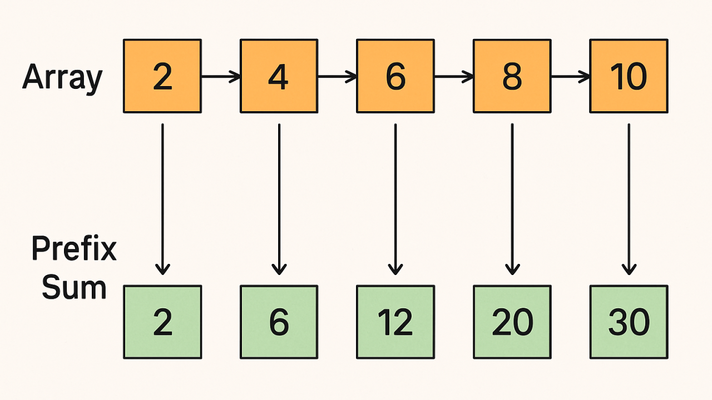
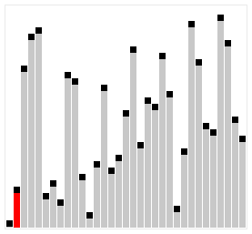
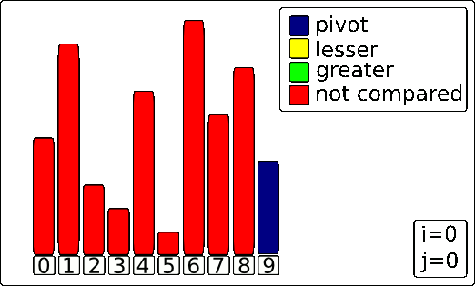
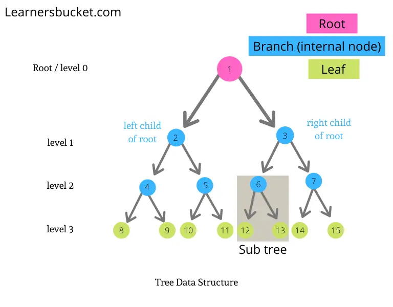
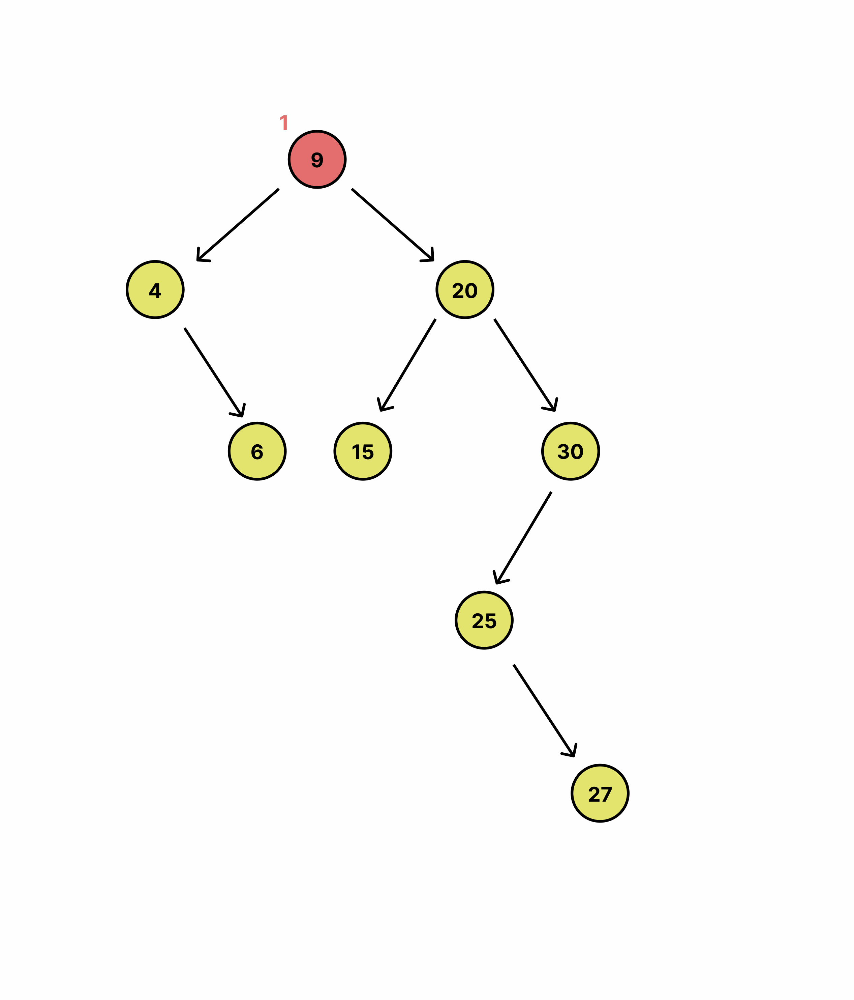
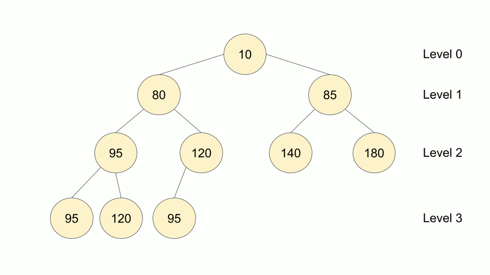
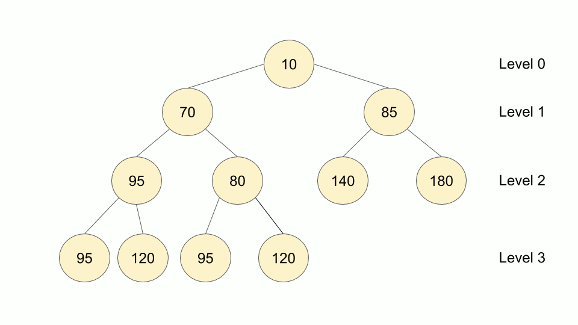

# DSA

# Algorithmic Patterns

## Prefix Sum



### Core Concept

Prefix Sum involves creating an auxiliary array where the value at each index `i` is the sum of all elements from the start of the original array up to that index. This allows for extremely fast calculations of contiguous subarray sums by transforming O(N) range sum loops into O(1) mathematical operations.

### When to Use

- **Frequent range queries:** When you need to calculate the sum of elements in a specific range `[left, right]` multiple times.
- **Subarray conditions:** Finding subarrays that meet certain sum criteria (e.g., "subarray sum equals k", as in your previous problem), especially when combined with a Hash Map.
- **Static data:** Highly efficient when the underlying array is not continuously modified. (Note: if elements change frequently, a Segment Tree or Fenwick Tree is more appropriate).

### Complexity

- **Time (Precomputation):** O(N) — Requires a single pass through the array to build the prefix sums.
- **Time (Query):** O(1) — Any range sum can be calculated in constant time.
- **Space:** O(N) — Typically requires an additional array of size N+1 to store the sums safely, though it can be O(1) if modifying the input array in-place.

### Properties

- **Category:** Precomputation / Array Pattern.
- **In-place:** Optional (Can overwrite the original array, but an auxiliary array is usually used to preserve original data).
- **Adaptable:** Yes (Can be expanded to 2D matrices for 2D range sum queries).

### Java Implementation

```java
public class PrefixSum {
    private int[] prefix;

    // Precomputes the prefix sums
    public PrefixSum(int[] arr) {
        // Using size + 1 handles the edge case of querying from index 0 elegantly
        prefix = new int[arr.length + 1];
        for (int i = 0; i < arr.length; i++) {
            prefix[i + 1] = prefix[i] + arr[i];
        }
    }

    // Returns the sum of elements from index 'left' to 'right' inclusive
    public int rangeSum(int left, int right) {
        return prefix[right + 1] - prefix[left];
    }
}
```

---

# **Sorting Algorithms**

## **Insertion Sort**



### Core Concept

The array is virtually split into a sorted and an unsorted part. Values from the unsorted part are picked one by one and placed at their correct position in the sorted part by shifting larger elements to the right.

### When to Use

- **Small datasets:** Minimal overhead makes it faster than complex algorithms like Quick Sort or Merge Sort for small arrays (typically fewer than 50 elements).
- **Nearly sorted data:** Its adaptive nature brings the time complexity closer to O(N).
- **Memory constraints:** It requires no extra memory allocation, running with an O(1) space footprint.
- **Continuous incoming data:** Its online property allows it to efficiently sort a live stream of data as new elements arrive.

### Complexity

- **Time (Best):** O(N) — Occurs when the array is already sorted.
- **Time (Average/Worst):** O(N^2) — Occurs when elements are in random or reverse order.
- **Space:** O(1) — Sorting is done in-place.

### Properties

- **Stable:** Yes (Maintains the relative order of equal elements).
- **In-place:** Yes (Does not require additional memory allocation).
- **Adaptive:** Yes (Highly efficient for small data sets or nearly sorted arrays).
- **Online:** Yes (Can sort a list as it receives new elements).

### Java Implementation

```java
public void insertionSort(int[] arr) {
    for (int i = 1; i < arr.length; i++) {
        int key = arr[i];
        int j = i - 1;

        // Shift elements greater than key to the right
        while (j >= 0 && arr[j] > key) {
            arr[j + 1] = arr[j];
            j--;
        }

        // Insert the key into its correct position
        arr[j + 1] = key;
    }
}
```

## Quick Sort (Lomuto Partition Scheme)




### Core Concept

The array is divided into two sub-arrays around a chosen pivot element. In this specific implementation, the rightmost element is always chosen as the pivot. Elements smaller than or equal to the pivot are shifted to its left, while larger elements remain on its right. This partitioning process is recursively applied to both sub-arrays until the entire array is sorted.

### When to Use

- **General-purpose sorting:** Excellent average-case performance for large, randomized datasets.
- **Memory constraints:** As an in-place algorithm, it is highly memory efficient, requiring no additional array allocations.
- **Cache performance:** Its contiguous memory access patterns make it highly cache-friendly and often faster in practice than algorithms like Merge Sort for primitive types.

### Complexity

- **Time (Best/Average):** O(N log N) — Occurs when the pivot consistently divides the array into roughly equal halves.
- **Time (Worst):** O(N^2) — Occurs when the array is already sorted, reverse sorted, or heavily populated with duplicate elements (due to the fixed rightmost pivot).
- **Space:** O(log N) on average — Sorting is done in-place, but the recursive call stack consumes memory. In the worst-case scenario, the space complexity degrades to O(N).

### Properties

- **Stable:** No (Swapping elements across the array disrupts the original relative order of identical elements).
- **In-place:** Yes (Does not require additional array memory allocation, only stack space for recursion).
- **Adaptive:** No (The standard Lomuto scheme does not inherently take advantage of pre-sorted data; in fact, pre-sorted data triggers its worst-case performance).
- **Online:** No (Requires the entire dataset to be present in memory to determine partitions and pivots).

### Java Implementation

```java
class Solution {

    static void quickSort(int[] ar) {
        if (ar == null || ar.length == 0) return;
        quickSort(ar, 0, ar.length - 1);
    }

    static int[] quickSort(int[] ar, int left, int right) {
        if (left >= right) return ar;

        int pivot = ar[right];
        int i = left - 1;

        // Shift elements smaller than or equal to pivot to the left
        for (int j = left; j < right; j++) {
            if (ar[j] <= pivot) {
                i++;
                int aux = ar[j];
                ar[j] = ar[i];
                ar[i] = aux;
            }
        }

        // Insert the pivot into its correct absolute position
        i++;
        int aux = ar[right];
        ar[right] = ar[i];
        ar[i] = aux;

        // Recursively sort the sub-arrays
        quickSort(ar, left, i - 1);
        quickSort(ar, i + 1, right);

        return ar;
    }
}
```

---

# **Data Structure - BST**

## Binary Search Tree (BST) Insertion




### Core Concept

The tree is traversed starting from the root. The new value is compared against the current node's value to determine the path: left if smaller, right if larger. This traversal continues until an empty spot (a null reference) is found, where the new node is then placed, preserving the fundamental property of the Binary Search Tree.

### When to Use

- **Iterative Approach:** Best for strict memory constraints or very deep trees. It avoids call stack overhead, completely eliminating the risk of `StackOverflowError` in highly unbalanced trees.
- **Recursive Approach:** Ideal for clean, readable, and highly maintainable code. It is often the expected baseline in technical assessments because it mirrors the natural, inductive definition of tree data structures.

### Complexity

- **Time (Best/Average):** O(log N) - Occurs when the tree is relatively balanced, halving the search space at each step.
- **Time (Worst):** O(N) - Occurs when elements are inserted in a sorted or reverse-sorted order, degrading the tree into a linear linked list.
- **Space (Iterative):** O(1) - Traversal and insertion are done strictly in-place using pointers.
- **Space (Recursive):** O(H) - Where H is the height of the tree, representing the memory consumed by the call stack.

## Properties

- **In-place:** Yes (Only requires memory allocation for the single new node).
- **Adaptive:** No (The standard insertion does not self-balance. Variations like AVL or Red-Black trees are needed for adaptability).
- **Ordered:** Yes (An in-order traversal of the resulting tree will yield elements in strictly ascending order).

### Java Implementation

### Iterative Version (O(1) Space)

```java
public Node insertIterative(Node root, int data) {
    if (root == null) {
        return new Node(data);
    }

    Node current = root;

    while (true) {
        if (data > current.data) {
            if (current.right == null) {
                current.right = new Node(data);
                break;
            }
            current = current.right;
        } else if (data < current.data) {
            if (current.left == null) {
                current.left = new Node(data);
                break;
            }
            current = current.left;
        } else {
            // Duplicate handling (optional): Break or handle as needed
            break;
        }
    }
    return root;
}
```

### Recursive Version (O(H) Space)

```java
public Node insertRecursive(Node root, int data) {
    if (root == null) {
        return new Node(data);
    }

    if (data > root.data) {
        root.right = insertRecursive(root.right, data);
    } else if (data < root.data) {
        root.left = insertRecursive(root.left, data);
    }

    // Returns the unchanged node pointer upwards through the call stack
    return root;
}
```

## Calculating BST Height with DFS



**Core Concept**
The height of a binary tree is defined as the number of edges on the longest path from the root node to a leaf. This algorithm applies a Depth-First Search (DFS) using a **Post-order** traversal strategy. It recursively explores both the left and right subtrees until it reaches the leaves. As the recursive calls return (backtracking), it compares the heights of the left and right subtrees, takes the maximum, and adds 1 to account for the edge connecting the current node to its deepest child. The base case (`root.left == null && root.right == null`) correctly establishes that a tree with only one node (the root) has a height of 0 (counting edges, not nodes).

**When to Use**

- **Balancing Checks:** Essential for implementing and maintaining self-balancing trees (like AVL trees), where the height difference between left and right subtrees must be monitored.
- **Performance/Memory Estimation:** Useful to determine the maximum call stack depth (which is strictly tied to the tree's height) required for other recursive tree operations.
- **Tree Metrics:** Whenever you need to know the longest path or maximum depth in a hierarchical structure.

**Complexity**

- **Time:** O(N) - Every single node in the tree must be visited exactly once to guarantee the deepest path is found.
- **Space (Worst):** O(N) - Occurs in a completely unbalanced tree (degraded into a linear linked list), where the recursive call stack reaches N frames.
- **Space (Average/Best):** O(H) or O(log N) - In a balanced tree, the maximum depth of the recursive call stack is limited to the tree's height (H).

**Properties**

- **Traversal Method:** Post-order DFS (It requires the results from the left and right children before it can calculate the value for the parent).
- **Measurement Convention:** Edge-based counting (A single node equals height 0).

### Java Implementation

```java
public static int height(Node root) {
    if (root == null || (root.left == null && root.right == null)) return 0;

    int l = height(root.left);
    int r = height(root.right);

    return 1 + Integer.max(l, r);
}
```

---

## Binary Tree Traversal Algorithms

This document covers the fundamental traversal algorithms for Binary Trees, designed to work seamlessly with tree structures where each `Node` contains `left` and `right` pointers and a `data` value.

## Depth-First Search (DFS)


**Core Concept**
DFS explores a tree by going as deep as possible along each branch before backtracking. It can be implemented in three main ways: In-order (Left, Root, Right), Pre-order (Root, Left, Right), and Post-order (Left, Right, Root).

**When to Use**

- **In-order:** Best for retrieving elements of a Binary Search Tree (BST) in sorted (ascending) order.
- **Pre-order:** Ideal for creating a copy/clone of the tree or serializing its structure.
- **Post-order:** Useful for safely deleting the tree (children are processed before the parent) or calculating directory sizes.

**Complexity**

- **Time (All variations):** O(N) - Every node is visited exactly once.
- **Space (Worst):** O(N) - Occurs in completely unbalanced trees (linear structure) due to call stack memory.
- **Space (Average/Best):** O(H) - Where H is the tree height, typically O(log N) for balanced trees.

**Properties**

- **Memory-efficient for deep, narrow trees:** Yes (Compared to BFS).
- **Implementation:** Typically recursive, mirroring the natural inductive definition of trees.

### Java Implementation (In-order)

```java
public void traverseInOrder(Node root) {
    if (root == null) {
        return;
    }

    traverseInOrder(root.left);
    System.out.print(root.data + " ");
    traverseInOrder(root.right);
}
```

## Breadth-First Search (BFS)


**Core Concept**
BFS explores the tree level by level, starting from the root and moving horizontally left-to-right across each depth level before moving down to the next level.

**When to Use**

- **Shortest Path:** Ideal for finding the shortest path between the root and a target node in unweighted graphs or trees.
- **Level Processing:** Useful when you need to process nodes in relation to their depth.

**Complexity**

- **Time:** O(N) - Every node is visited exactly once.
- **Space (Worst):** O(N) - Occurs in a perfectly balanced tree where the bottom level holds roughly N/2 nodes, requiring proportional queue size.
- **Space (Best):** O(1) - Occurs in completely unbalanced (linear) trees where the maximum width is 1.

**Properties**

- **Memory-efficient for wide trees:** No (Requires storing entire levels simultaneously).
- **Implementation:** Iterative, utilizing a First-In-First-Out (FIFO) queue data structure.

### Java Implementation (Queue-based)

```java
import java.util.LinkedList;
import java.util.Queue;

public void traverseLevelOrder(Node root) {
    if (root == null) {
        return;
    }

    Queue<Node> queue = new LinkedList<>();
    queue.add(root);

    while (!queue.isEmpty()) {
        Node current = queue.poll();
        System.out.print(current.data + " ");

        if (current.left != null) {
            queue.add(current.left);
        }
        if (current.right != null) {
            queue.add(current.right);
        }
    }
}
```

---

# **Data Structure - Heap**

## Binary Heap





### Core Concept

A Heap is a specialized tree-based data structure that satisfies the heap property. In a Max-Heap, for any given node C, if P is a parent node of C, then the key (the value) of P is greater than or equal to the key of C. In a Min-Heap, the key of P is less than or equal to the key of C. The tree is completely filled on all levels except possibly for the lowest, which is filled from left to right, making it a complete binary tree. This structure allows it to be efficiently represented as a flat array.

### When to Use

- **Priority Queues:** Ideal for implementing priority queues where you continuously need to insert elements and extract the element with the highest or lowest priority.
- **Graph Algorithms:** Essential for optimizing algorithms like Dijkstra's Shortest Path or Prim's Minimum Spanning Tree, which require frequent access to the minimum edge weight.
- **Finding K-th Extremes:** Best approach for efficiently finding the K-th largest or smallest element in a stream of data or a large array without sorting the entire dataset.
- **Heap Sort:** Useful when an in-place sorting algorithm with a guaranteed O(N log N) worst-case time complexity is required.

### Complexity

- **Time (Insertion):** O(log N) - The new element is added at the end of the tree and "bubbled up" to its correct position to restore the heap property.
- **Time (Extract Min/Max):** O(log N) - The root is removed, replaced by the last element, and then "bubbled down" to restore the heap property.
- **Time (Peek):** O(1) - The minimum (or maximum) element is always immediately accessible at the root of the tree (array index 0).
- **Time (Build Heap):** O(N) - Building a heap from an unsorted array using the optimal bottom-up heapify approach (Floyd's algorithm).
- **Space (Standard):** O(N) - The memory required to store the N elements within the array representation.

### Properties

- **Shape Property:** Yes (It strictly maintains a complete binary tree structure, ensuring optimal height of O(log N)).
- **Heap Property:** Yes (Strict enforcement of parent-child value relationships depending on whether it is a Min-Heap or Max-Heap).
- **Ordered:** No (Unlike a Binary Search Tree, left and right siblings have no specific order relative to each other).
- **In-place Representation:** Yes (Because it is a complete binary tree, it is typically implemented using a 1D array without needing pointers for left/right children).

### Java Implementation

**1. Built-in Min/Max-Heap (using `java.util.PriorityQueue`)**

The most practical way to use a Heap in Java in a day-to-day scenario is through the standard library. By default, `PriorityQueue` implements a Min-Heap.

```java
import java.util.PriorityQueue;
import java.util.Collections;

public class HeapExample {
    public static void main(String[] args) {
        // Min-Heap (Default)
        PriorityQueue<Integer> minHeap = new PriorityQueue<>();
        minHeap.add(10);
        minHeap.add(5);
        minHeap.add(20);

        System.out.println("Min-Heap Peek: " + minHeap.peek()); // 5
        System.out.println("Min-Heap Poll: " + minHeap.poll()); // 5 (removes 5)

        // Max-Heap (Using a custom comparator)
        PriorityQueue<Integer> maxHeap = new PriorityQueue<>(Collections.reverseOrder());
        maxHeap.add(10);
        maxHeap.add(5);
        maxHeap.add(20);

        System.out.println("Max-Heap Peek: " + maxHeap.peek()); // 20
        System.out.println("Max-Heap Poll: " + maxHeap.poll()); // 20 (removes 20)
    }
}
```

**2. Manual Min-Heap (Array Representation)**

For educational purposes, this is how a Min-Heap is mathematically mapped to a flat array under the hood.

```java
import java.util.Arrays;

public class MinHeap {
    private int[] heap;
    private int size;
    private int capacity;

    public MinHeap(int capacity) {
        this.capacity = capacity;
        this.size = 0;
        this.heap = new int[capacity];
    }

    private int parent(int i) { return (i - 1) / 2; }
    private int leftChild(int i) { return 2 * i + 1; }
    private int rightChild(int i) { return 2 * i + 2; }

    private void swap(int i, int j) {
        int temp = heap[i];
        heap[i] = heap[j];
        heap[j] = temp;
    }

    public void insert(int key) {
        if (size == capacity) {
            heap = Arrays.copyOf(heap, capacity * 2);
            capacity *= 2;
        }
        int i = size;
        heap[size++] = key;

        // Heapify Up (siftUp)
        while (i != 0 && heap[parent(i)] > heap[i]) {
            swap(i, parent(i));
            i = parent(i);
        }
    }

    public int extractMin() {
        if (size <= 0) return Integer.MAX_VALUE;
        if (size == 1) return heap[--size];

        int root = heap[0];
        heap[0] = heap[--size];
        minHeapify(0);

        return root;
    }

    // Heapify Down (siftDown)
    private void minHeapify(int i) {
        int left = leftChild(i);
        int right = rightChild(i);
        int smallest = i;

        if (left < size && heap[left] < heap[smallest]) smallest = left;
        if (right < size && heap[right] < heap[smallest]) smallest = right;

        if (smallest != i) {
            swap(i, smallest);
            minHeapify(smallest);
        }
    }
}
```

---